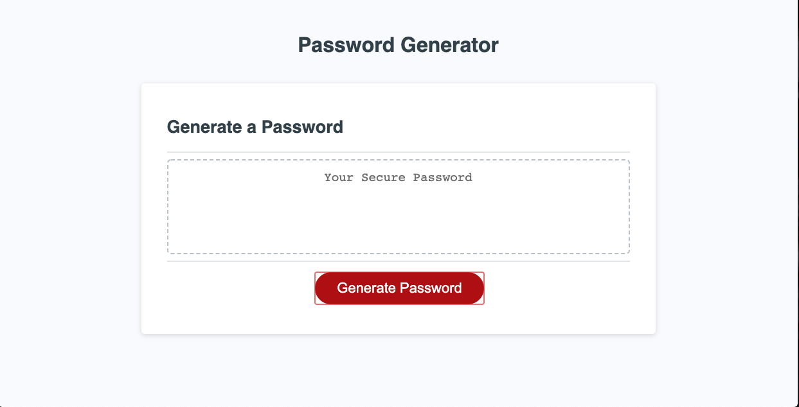
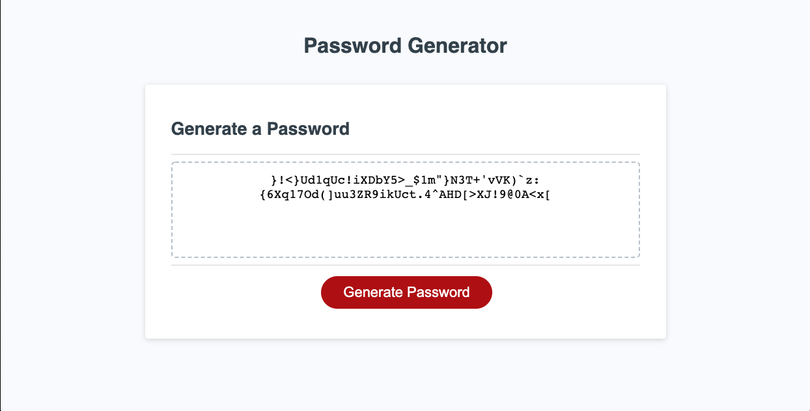

# Random-Password-Generator

## Summary

In this assignment, we were tasked with building out a random password generator. We provided with starter code in the form of `index.html`, `style.css`, `script.js` files. From there, we are supposed to  and sing our knowledge of HTML, CSS, and Bootstraps, we needed to create a `index.html`, `portfolio.html`, and `contact.html` files and personalize each page to ourselves. 

## Instruction

Navigate to the following Github repository:
    https://github.com/hsaddanathan/random-password-generator.git

Across the top of the page, click on the Fork button on the right.

Once you have done this, you will see the repo copied within your Github account

Click the Green "Code" Button, and copy repo link. 

Open Terminal and run "git clone (Paste Link Here)"

Once repo has been cloned, you can run " code ." to open in Visual Studio Code. 

From there, right click and select "Open in Default Browser" to preview the page, or you can inspect the code from Visual Studio Code.

Alternatively, if you would like to only view the page please reference:
    https://hsaddanathan.github.io/random-password-generator/

## Deployed Site Images

Image depicts landing page

Image shows computed password with 75 characters.

## Links

student-portfolio repository link:
    https://github.com/hsaddanathan/random-password-generator.git

Github Deployed Site URL:
    https://hsaddanathan.github.io/random-password-generator/

## Contributors 
[@hsaddanathan](https://github.com/hsaddanathan)

